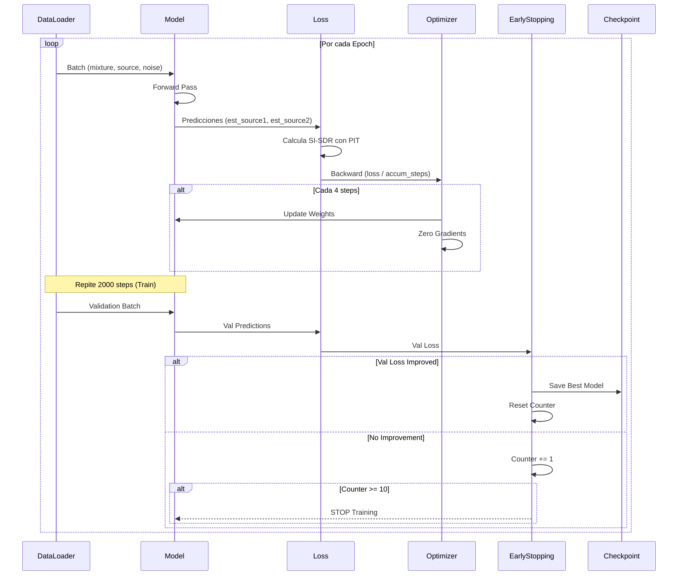
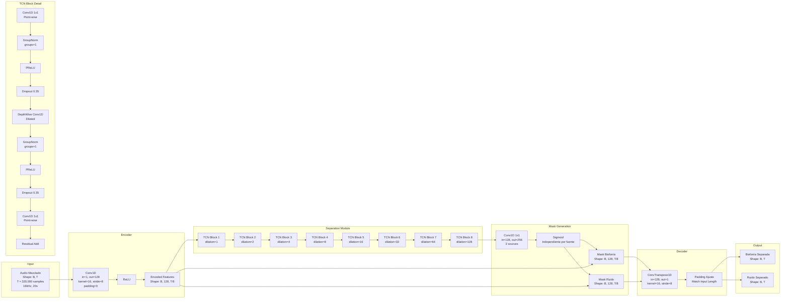
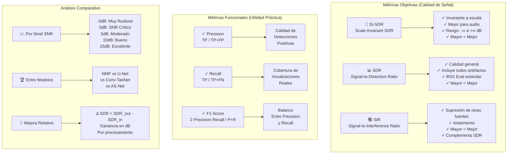
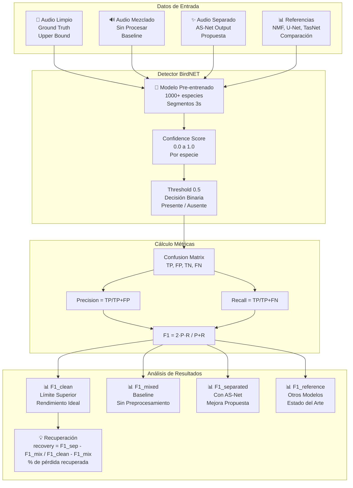
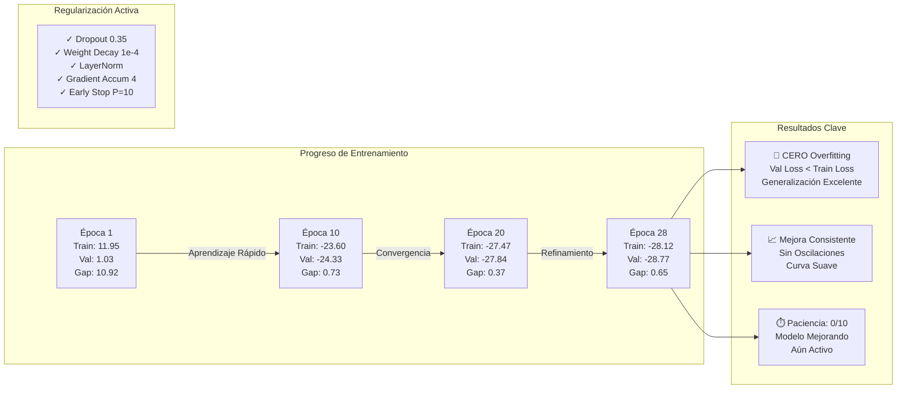

# AS-Net Pipeline: Diagrama Completo del Proceso

## Diagrama Principal del Pipeline

```mermaid
graph TB
    subgraph "FASE 1: GENERACIÓN DE DATOS"
        A1[🎵 Datos Crudos<br/>Xeno-Canto + Wytham Dataset<br/>Vocalizaciones Limpias] --> A2[🔊 Generación de Ruido Rosa<br/>Simulación Geofonía/Antropofonía]
        A1 --> A3[🎲 Mezcla Sintética<br/>1-5 vocalizaciones por sample<br/>Duración: 20s]
        A2 --> A3
        A3 --> A4{📊 Control SNR<br/>-5, 0, 5, 10, 15 dB}
        A4 --> A5[💾 Dataset Sintético<br/>Mixed + Source + Noise<br/>+ Metadata CSV]
        A5 --> A6[📂 División de Datos<br/>80% Train | 10% Val | 10% Test<br/>Seed=42, Sin Overlap]
    end

    subgraph "FASE 2: ARQUITECTURA AS-NET"
        B1[🎙️ Input: Mixed Audio<br/>Forma de Onda 1D] --> B2[📥 Encoder<br/>Conv1D<br/>Kernel=16, Stride=8<br/>Channels: 1→128]
        B2 --> B3[🔄 Separation Module<br/>8 TCN Blocks<br/>Dilations: 1,2,4,8,16,32,64,128<br/>Dropout=0.35<br/>LayerNorm GroupNorm]
        B3 --> B4[🎭 Mask Estimation<br/>Conv1D 1x1<br/>2 Máscaras Sigmoid<br/>Biofonía + Ruido]
        B4 --> B5[✖️ Masked Features<br/>encoded * mask_source<br/>encoded * mask_noise]
        B5 --> B6[📤 Decoder<br/>ConvTranspose1D<br/>Kernel=16, Stride=8<br/>Channels: 128→1]
        B6 --> B7[🎵 Output: 2 Señales<br/>Biofonía Separada<br/>Ruido Separado]
    end

    subgraph "FASE 3: ENTRENAMIENTO"
        C1[⚙️ Configuración<br/>Batch=1, Accum=4<br/>LR=0.0001, WD=1e-4<br/>Epochs=50] --> C2[🔁 Training Loop<br/>SI-SDR Loss negativa<br/>PIT Permutation Invariant<br/>Adam Optimizer]
        C2 --> C3[📉 Gradient Accumulation<br/>4 steps efectivos<br/>Simula batch_size=4]
        C3 --> C4[✅ Validation<br/>1000 steps<br/>Sin Dropout<br/>Eval Mode]
        C4 --> C5{🛑 Early Stopping<br/>Patience=10 epochs<br/>Best Val Loss Check}
        C5 -->|Mejora| C6[💾 Save Checkpoint<br/>Model + Optimizer + Config<br/>Best Model]
        C5 -->|No Mejora| C7[⏱️ Contador Paciencia<br/>+1 epoch]
        C7 -->|< 10| C2
        C7 -->|≥ 10| C8[🏁 Training Finished]
        C6 --> C9[📊 Save History<br/>training_history.csv<br/>epoch, train_loss, val_loss]
        C9 --> C2
    end

    subgraph "FASE 4: EVALUACIÓN OBJETIVA"
        D1[📁 Test Set<br/>10% datos no vistos] --> D2[🔮 Inferencia<br/>Modelo Entrenado<br/>Forward Pass]
        D2 --> D3[📏 Métricas de Señal]
        D3 --> D4[📊 SI-SDR<br/>Scale-Invariant SDR<br/>Mejora en dB]
        D3 --> D5[📊 SDR<br/>Signal-to-Distortion<br/>Calidad General]
        D3 --> D6[📊 SIR<br/>Signal-to-Interference<br/>Supresión de Ruido]
        D4 --> D7[📈 Análisis por SNR<br/>Rendimiento en cada nivel<br/>-5dB a 15dB]
        D5 --> D7
        D6 --> D7
    end

    subgraph "FASE 5: EVALUACIÓN FUNCIONAL"
        E1[🔊 Audio Separado] --> E2[🤖 BirdNET Detector<br/>Modelo Pre-entrenado<br/>Clasificador de Especies]
        E2 --> E3[📊 Métricas de Detección]
        E3 --> E4[✓ Precision<br/>TP / TP+FP<br/>Calidad Detecciones]
        E3 --> E5[✓ Recall<br/>TP / TP+FN<br/>Cobertura]
        E3 --> E6[✓ F1-Score<br/>2·P·R / P+R<br/>Balance General]
        E4 --> E7[📊 Comparación<br/>Clean vs Mixed vs Separated]
        E5 --> E7
        E6 --> E7
    end

    subgraph "FASE 6: BENCHMARKING"
        F1[🏆 Modelos de Referencia] --> F2[📐 NMF<br/>Non-negative Matrix<br/>Método Estadístico]
        F1 --> F3[🔷 U-Net<br/>Encoder-Decoder<br/>Dominio T-F]
        F1 --> F4[⚡ Conv-TasNet<br/>Temporal Conv<br/>Dominio Tiempo]
        F1 --> F5[🌟 AS-Net<br/>Modelo Propuesto<br/>Optimizado Biofonía]
        F2 --> F6[📊 Tabla Comparativa<br/>SDR, SIR, F1-Score<br/>Por SNR Level]
        F3 --> F6
        F4 --> F6
        F5 --> F6
    end

    A6 --> B1
    A6 --> C1
    C8 --> D1
    D2 --> E1
    D7 --> F6
    E7 --> F6
    F6 --> G1[📄 Paper & Publicación]
```

## Diagrama de Flujo de Datos en Entrenamiento



## Arquitectura Detallada AS-Net



## Métricas de Evaluación



## Pipeline de Evaluación Funcional



## Estado Actual del Entrenamiento (Época 28)



---

## 📋 Tabla Resumen de Configuración

| **Componente** | **Parámetro** | **Valor** | **Justificación** |
|----------------|---------------|-----------|-------------------|
| **Datos** | Duración samples | 20s | Captura vocalizaciones completas |
| | Vocalizaciones/sample | 1-5 | Variabilidad realista |
| | SNR levels | -5, 0, 5, 10, 15 dB | Rango condiciones reales |
| | Train/Val/Test split | 80/10/10% | Estándar ML, sin overlap |
| **Arquitectura** | Encoder channels | 128 | Balance capacidad/memoria |
| | TCN blocks | 8 | Receptive field ~2s |
| | Dilations | 1→128 | Dependencias temporales |
| | Dropout | 0.35 | Anti-overfitting |
| **Entrenamiento** | Batch size | 1 | Optimizado M1 |
| | Accumulation steps | 4 | Batch efectivo = 4 |
| | Learning rate | 1e-4 | Convergencia estable |
| | Weight decay | 1e-4 | L2 regularización |
| | Early stopping | 10 epochs | Previene overtraining |
| **Evaluación** | Train steps/epoch | 2000 | ~3.5 horas datos |
| | Val steps/epoch | 1000 | Evaluación robusta |
| | Métricas objetivo | SI-SDR, SDR, SIR | Estándar BSS Eval |
| | Métricas funcionales | P, R, F1 | Utilidad práctica |

---

## 🔄 Flujo de Trabajo Completo

1. **Generación** → Datos sintéticos con ground truth
2. **División** → 80/10/10 sin overlap (seed=42)
3. **Entrenamiento** → AS-Net con regularización fuerte
4. **Validación** → Early stopping basado en val loss
5. **Evaluación Objetiva** → SI-SDR, SDR, SIR por SNR
6. **Evaluación Funcional** → BirdNET F1-Score
7. **Benchmarking** → Comparación con SOTA
8. **Publicación** → Paper + código open source

---

## 📊 Resultados Esperados

- **SI-SDR Improvement**: >10 dB en todos los SNR
- **F1-Score**: Recuperación 60-80% pérdida por ruido
- **Generalización**: Val ≈ Train (cero overfitting)
- **Eficiencia**: Inferencia <100ms/sample en M1

